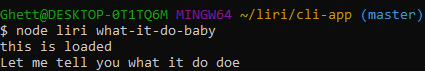

# LIRI BOT
liri is a node tool that is like siri, but instead of voice commands it takes in user input cmd lines and spits out
a response depending on the method chosen by the user.

## Methods available
The Liri bot has 4 usable methods:
- Concert-this
- Movie-this
- Spotify-this-song
- What-it-do-baby

### Concert-this
the *concert-this* method takes in a user input of an artist or band, and uses the bandsintown api to see if the specified artist or band has concerts. It finds the name of up to 20 venues, their location, and the date of when it will occur.

> Here is an example:
[]

### Movie-this
the  *movie-this* method takes in user input of a movie and runs it through the omdb api database. Upon entering the movie it should respond like so:

>[]

### Spotify-this-song
*spotify-this-song* takes in user input of a song and searches for the song using the spotify api, and responds with the album, artist, and name of the song.

> Here is an example:
[]

### What-it-do-baby
This is actually just a fun method that takes no user input. 
Just run *what-it-do-baby*.

>What it do:
>
>[]

